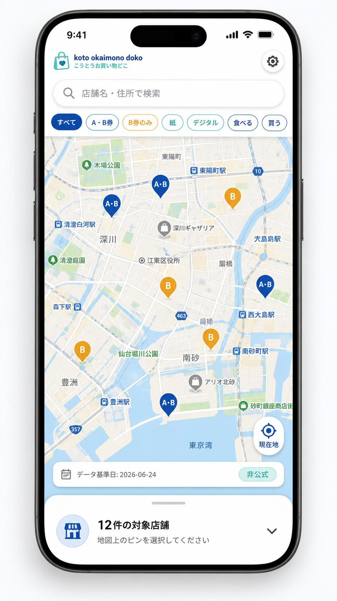
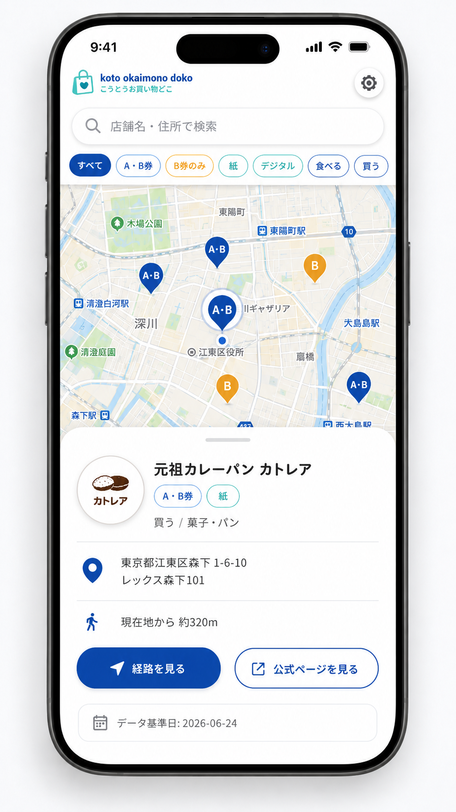
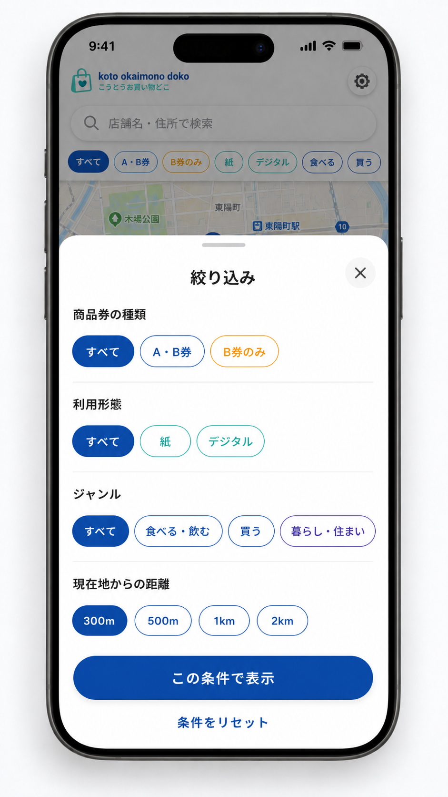
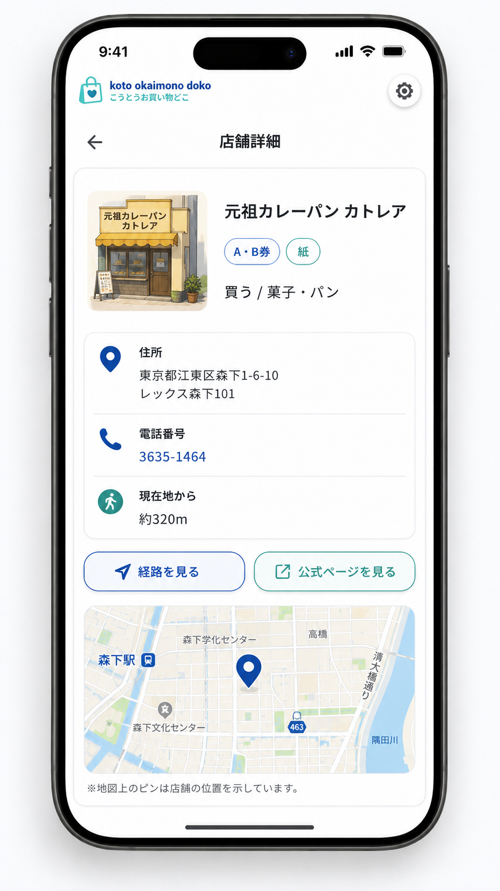
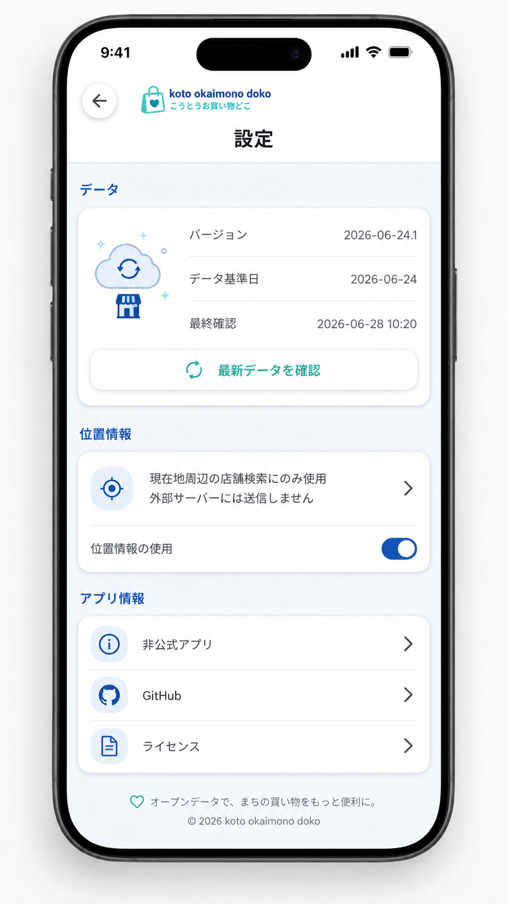
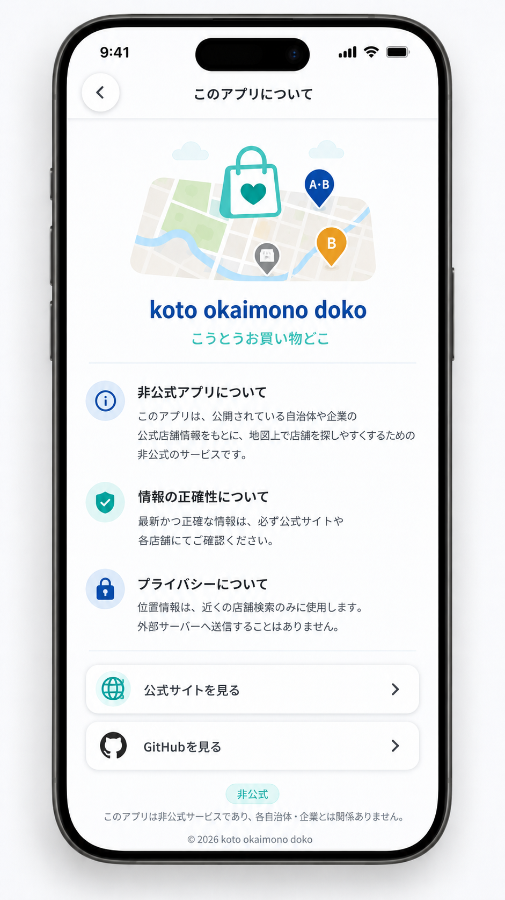

# koto okaimono doko Wireframes

`koto okaimono doko`는 江東区プレミアム付商品券의 사용 가능 점포를 **현재 위치 기준으로 빠르게 찾는 비공식 지도 앱**이다.

이 문서는 React Native + Expo + Expo Router + Uniwind 기준의 wireframe과 sample screen을 함께 정리한다. 구현 우선순위는 **지도 → 필터 → 점포 상세 → 데이터 업데이트 상태** 순서다.

Brand text:

```txt
English: koto okaimono doko
Japanese: こうとうお買い物どこ
```

---

## 0. Sample screens

| Screen | Sample |
|---|---|
| Map Home | [`screen-map-home.png`](./wireframes/images/screen-map-home.png) |
| Store Bottom Sheet | [`screen-store-bottom-sheet.png`](./wireframes/images/screen-store-bottom-sheet.png) |
| Filter Modal | [`screen-filter-modal.png`](./wireframes/images/screen-filter-modal.png) |
| Store Detail Route | [`screen-store-detail.png`](./wireframes/images/screen-store-detail.png) |
| Settings | [`screen-settings.png`](./wireframes/images/screen-settings.png) |
| About / Unofficial Notice | [`screen-about.png`](./wireframes/images/screen-about.png) |

---

## 1. Product Intent

### Core message

```txt
近くで使える商品券対応店舗を、地図ですぐ確認する。
```

### Primary users

| User | Need |
|---|---|
| 江東区 주민 | 현재 위치 주변에서 상품권 사용 가능 점포를 찾고 싶다 |
| 상품권 보유자 | A/B권, B권 전용, 紙/デジタル対応 여부를 빠르게 확인하고 싶다 |
| 쇼핑몰 방문자 | 대형시설 안에서 어떤 점포가 대상인지 보고 싶다 |
| 개발자/OSS 평가자 | PDF/HTML 기반 공공 데이터를 앱 데이터로 바꾸는 구조를 확인하고 싶다 |

### UX principle

```txt
Map first.
Filter fast.
Detail only when needed.
Offline by default.
Unofficial and transparent.
```

---

## 2. Global Navigation

Expo Router route map:

```txt
app/
  _layout.tsx
  index.tsx              // Map Home
  filters.tsx            // Filter modal
  store/
    [id].tsx             // Store detail deep link
  settings.tsx           // Dataset / privacy / update
  about.tsx              // Unofficial notice / OSS info
```

Navigation hierarchy:

```txt
Map Home
 ├─ Filter Modal
 ├─ Store Bottom Sheet
 │   ├─ External map app
 │   └─ Official store detail
 ├─ Store Detail Route // deep link only
 ├─ Settings
 └─ About
```

---

## 3. Visual Direction

### Tone

```txt
Local, practical, clear, trustworthy.
```

The app should not look like an official government app. It should clearly communicate that it is an independent utility built from public store-list data.

### UI character

| Element | Direction |
|---|---|
| Map | Takes most of the screen |
| Filters | Compact chips, not heavy forms |
| Store detail | Bottom sheet, not full page by default |
| Badges | Coupon availability must be immediately visible |
| Data status | Small but always discoverable |
| Color | Functional; avoid official branding imitation |

### Suggested labels

| Korean concept | Japanese UI label |
|---|---|
| 전체 | すべて |
| 주변 | 近く |
| 필터 | 絞り込み |
| 검색 | 店舗名・住所で検索 |
| 현재 위치 | 現在地 |
| 길찾기 | 経路を見る |
| 공식 상세 | 公式ページを見る |
| 데이터 기준일 | データ基準日 |
| 비공식 | 非公式 |

---

## 4. Screen 01 — Map Home



### Purpose

The main screen answers:

```txt
Where can I use my coupon near me?
```

### Wireframe

```txt
┌─────────────────────────────────────┐
│  koto okaimono doko             ⚙︎   │
│  店舗名・住所で検索                  │
│  [すべて] [A・B券] [B券のみ] [紙]   │
│  [デジタル] [食べる] [買う]         │
├─────────────────────────────────────┤
│                                     │
│              MAP AREA               │
│                                     │
│       [A・B]       [B]              │
│            [A・B]                   │
│                          ◎ 現在地   │
│                                     │
├─────────────────────────────────────┤
│  12件の対象店舗                     │
│  地図上のピンを選択してください     │
└─────────────────────────────────────┘
```

### Components

| Component | Role |
|---|---|
| SearchInput | Keyword search by store name, address, mall name |
| FilterChips | Frequently used filters (incl. a `絞り込み` chip that opens the full filter modal) |
| MapView | Store markers and user location |
| CurrentLocationButton | Move camera to current location (disabled when location is off) |
| StoreBottomSheet | Draggable sheet: peek shows visible count / empty hint, expands to selected store(s) |

> The dataset date / `非公式` badge that used to float under the map was removed; the
> dataset date is available in Settings and inside the selected-store sheet.

### Map initial state

```txt
- Center: 江東区 approximate center
- Zoom: city-level view
- If location permission is granted: move to current location
- If location permission is denied: keep map usable
```

### Marker types

```txt
[A・B] A・B券対応
[B]   B券のみ
[M]   Mall/facility group
```

### Marker behavior

```txt
Tap marker
  → set selectedStoreId
  → open bottom sheet
  → highlight marker

Tap map empty area
  → clear selectedStoreId
  → collapse bottom sheet
```

### Empty state on map

```txt
この範囲に対象店舗がありません。
条件を変更するか、地図を移動してください。
[絞り込みをリセット]
```

---

## 5. Screen 02 — Store Bottom Sheet



> Implemented with `@gorhom/bottom-sheet` as a draggable sheet with two snap points
> (a collapsed peek and an expanded detail view). Selecting a marker snaps it open;
> the collapsed peek shows the visible-store count, or the empty-state hint + reset
> when nothing matches.

### Collapsed state

```txt
┌─────────────────────────────────────┐
│  12件の対象店舗                     │
│  地図上のピンを選択してください     │
└─────────────────────────────────────┘
```

### Selected store state

```txt
┌─────────────────────────────────────┐
│  ━━━━━                              │
│  元祖カレーパン カトレア            │
│  [A・B券] [紙]                      │
│                                     │
│  買う / 菓子・パン                  │
│  東京都江東区森下1-6-10             │
│  レックス森下101                    │
│                                     │
│  現在地から 約320m                  │
│                                     │
│  [経路を見る]  [公式ページを見る]   │
│                                     │
│  データ基準日: 2026-06-24           │
└─────────────────────────────────────┘
```

### Mall/facility group state

```txt
┌─────────────────────────────────────┐
│  アーバンドック ららぽーと豊洲      │
│  [施設内 42店舗]                    │
│  豊洲2-4-9                          │
│                                     │
│  URBAN RESEARCH DOORS  [B券]        │
│  1F / 買う / 衣服                   │
│                                     │
│  RHC CAFE  [B券]                    │
│  1F / 食べる・飲む / カフェ         │
│                                     │
│  [施設への経路を見る]              │
└─────────────────────────────────────┘
```

### Detail priorities

1. Store name
2. Coupon type
3. Paper/digital availability
4. Category
5. Address / floor
6. Distance from current location
7. Route button
8. Official link
9. Data date

---

## 6. Screen 03 — Filter Modal



### Purpose

Fast narrowing by coupon availability and practical shopping intent.

### Wireframe

```txt
┌─────────────────────────────────────┐
│  絞り込み                       ✕   │
├─────────────────────────────────────┤
│  商品券の種類                       │
│  [すべて] [A・B券] [B券のみ]        │
│                                     │
│  利用形態                           │
│  [すべて] [紙] [デジタル]           │
│                                     │
│  ジャンル                           │
│  [すべて] [食べる・飲む] [買う]    │
│  [暮らし・住まい]                  │
│                                     │
│  現在地からの距離                   │
│  [すべて] [300m] [500m] [1km] [2km] │
│                                     │
│  [この条件で表示]                   │
│  条件をリセット                    │
└─────────────────────────────────────┘
```

### Behavior

```txt
- Changing chips updates local Zustand filter state.
- Pressing primary button closes modal and refreshes map query.
- Reset returns to default filters.
```

### Default filter values

```ts
{
  keyword: '',
  couponType: 'all',
  payment: 'all',
  categoryMajor: null,
  radiusMeters: 'all'
}
```

> Distance chips (`300m`–`2km`) require location: they are disabled when the location
> preference is off or no current location is available, and the default is `すべて`
> (no distance filter) so enabling location never silently hides stores.

---

## 7. Screen 04 — Store Detail Route



### Purpose

Used mainly for deep link or shared store URL.

### Wireframe

```txt
┌─────────────────────────────────────┐
│  ← 店舗詳細                         │
├─────────────────────────────────────┤
│  元祖カレーパン カトレア            │
│  [A・B券] [紙]                      │
│                                     │
│  ジャンル                           │
│  買う / 菓子・パン                  │
│                                     │
│  住所                               │
│  東京都江東区森下1-6-10             │
│  レックス森下101                    │
│                                     │
│  電話番号                           │
│  3635-1464                          │
│                                     │
│  位置                               │
│  現在地から 約320m                  │
│                                     │
│  [経路を見る]                       │
│  [公式ページを見る]                 │
│                                     │
│  MAP PREVIEW                        │
└─────────────────────────────────────┘
```

### Behavior

```txt
- If opened from marker: keep map stack state.
- If opened directly by deep link: query store by id, then show detail.
- If store id is missing in current dataset: show stale-link state.
```

### Stale link state

```txt
店舗が見つかりません。
この店舗は最新データに含まれていない可能性があります。
[地図に戻る]
```

---

## 8. Screen 05 — Settings



### Purpose

Make the data pipeline visible and trustworthy.

### Wireframe

```txt
┌─────────────────────────────────────┐
│  ← 設定                             │
├─────────────────────────────────────┤
│  データ                             │
│  バージョン       2026-06-24.1      │
│  データ基準日     2026-06-24        │
│  最終確認         2026-06-28 10:20  │
│  [最新データを確認]                 │
│                                     │
│  位置情報                           │
│  現在地周辺の店舗検索にのみ使用     │
│  外部サーバーには送信しません       │
│                                     │
│  アプリ情報                         │
│  非公式アプリ                       │
│  GitHub                             │
│  ライセンス                         │
└─────────────────────────────────────┘
```

### Dataset update states

| State | Copy |
|---|---|
| Up to date | 最新データです。 |
| Checking | 最新データを確認しています… |
| Downloading | データを更新しています… |
| Updated | データを更新しました。 |
| Failed | データ更新に失敗しました。現在保存されているデータで利用できます。 |

---

## 9. Screen 06 — About / Unofficial Notice



### Purpose

Reduce misunderstanding and clarify data source policy.

### Wireframe

```txt
┌─────────────────────────────────────┐
│  ← このアプリについて               │
├─────────────────────────────────────┤
│  koto okaimono doko                 │
│  こうとうお買い物どこ               │
│                                     │
│  非公式アプリについて               │
│  公開されている公式店舗情報をもとに │
│  地図上で店舗を探しやすくするための │
│  非公式のサービスです。             │
│                                     │
│  情報の正確性について               │
│  最新かつ正確な情報は、必ず公式     │
│  サイトや各店舗にてご確認ください。 │
│                                     │
│  プライバシーについて               │
│  位置情報は近くの店舗検索のみに     │
│  使用します。外部へ送信しません。   │
│                                     │
│  [公式サイトを見る]                 │
│  [GitHubを見る]                     │
│  非公式                             │
└─────────────────────────────────────┘
```

Recommended notice text:

```txt
このアプリは非公式アプリです。
掲載情報は公式サイトで公開されている店舗情報をもとに独自に地図化しています。
最新かつ正確な情報は公式サイトまたは各店舗にてご確認ください。

位置情報は現在地周辺の店舗検索にのみ使用し、外部サーバーには送信しません。
```

---

## 10. Empty / Error / Permission States

### Location permission prompt context

```txt
現在地を使いますか？
近くで使える商品券対応店舗を表示するために現在地を使用します。
位置情報は外部サーバーに送信しません。

[現在地を使用する]
[あとで]
```

### Permission denied

```txt
現在地を取得できません。
地図を移動して店舗を探すことはできます。
```

### Offline

```txt
オフラインです。
保存済みのデータで表示しています。
```

### Dataset missing critical error

```txt
店舗データを読み込めませんでした。
アプリを再起動するか、データを再取得してください。
```

---

## 11. Component Inventory

```txt
components/ui/
  Box.tsx
  Text.tsx
  Button.tsx
  Chip.tsx
  Card.tsx
  IconButton.tsx
  SearchInput.tsx
  EmptyState.tsx
  LoadingState.tsx

components/map/
  StoreMap.tsx
  StoreMarker.tsx
  UserLocationButton.tsx

components/store/
  StoreBottomSheet.tsx
  StoreListItem.tsx
  StoreDetailContent.tsx
  CouponBadge.tsx
  PaymentBadge.tsx

components/dataset/
  DatasetBadge.tsx
  DatasetUpdateStatus.tsx
```

---

## 12. State Mapping

### Zustand stores

```txt
filterStore
  keyword
  couponType
  payment
  categoryMajor
  radiusMeters

mapStore
  region
  userLocation
  isFollowingUser

selectedStoreStore
  selectedStoreId

datasetStore
  version
  officialUpdatedAt
  generatedAt
  lastCheckedAt
  updateStatus
```

Full Store list must not be stored in Zustand. SQLite is the source of truth. Zustand only controls UI state.

---

## 13. Query Timing

```txt
App boot
  → ensure active SQLite
  → read dataset_meta
  → render map

Map region change complete
  → debounce 250ms
  → calculate bounds
  → query SQLite
  → render visible markers

Filter change
  → update Zustand
  → query SQLite
  → render visible markers

Marker press
  → selectedStoreId
  → getStoreById
  → open bottom sheet
```

---

## 14. MVP Acceptance Criteria

### Map Home

```txt
- User can see store markers on map.
- User can search by keyword.
- User can filter by coupon type.
- User can filter by paper/digital availability.
- User can see current dataset date.
```

### Location

```txt
- App asks foreground location permission only.
- App works even when permission is denied.
- User location is not uploaded.
```

### Store detail

```txt
- User can open store detail from marker.
- User can see coupon type and payment availability.
- User can open external map route.
- User can open official detail page when available.
```

### Dataset

```txt
- App starts offline with bundled seed SQLite.
- App can check manifest.json.
- App can download a newer SQLite file.
- App verifies SHA-256 before replacing local DB.
- Failed update does not break existing data.
```

---

## 15. Implementation Priority

```txt
1. App shell + Uniwind primitives
2. Seed SQLite boot
3. StoreRepository
4. Map Home
5. Store markers
6. Bottom sheet detail
7. Search and filters
8. Current location
9. Dataset updater
10. Settings / About
```

---

## 16. Notes for AI Implementation Agent

```txt
- Do not add a large UI framework.
- Do not add Mapbox for MVP.
- Do not add EAS Update for MVP.
- Do not parse PDF on device.
- Do not create a backend.
- Use Japanese UI copy for app screens.
- Keep wireframe structure simple and map-first.
- Prefer bottom sheets over deep nested screens.
- Keep data transparency visible but not intrusive.
```

---

## 17. Implementation Deltas vs Wireframe (current build)

Intentional differences between these wireframes and the shipped screens:

- **Location preference is functional and can be OFF.** Settings has a real toggle
  (`位置情報の使用`) persisted to AsyncStorage (default ON). When off, the current
  location is not requested, the map hides the user dot, the current-location button
  is disabled, and distance/radius features are inactive.
- **Distance (radius) filter is wired.** `radiusMeters` is `'all' | 300 | 500 | 1000 | 2000`
  (default `'all'`). When location is available and a distance is chosen, map results are
  filtered to that radius of the current location; otherwise the distance chips are
  disabled with a hint and the map stays viewport-based.
- **Store sheet is a draggable bottom sheet** (`@gorhom/bottom-sheet`) rather than a
  fixed panel; the empty state lives inside its collapsed peek.
- **The under-map dataset date / `非公式` badge was removed.** The dataset date is shown
  in Settings and in the selected-store sheet; the unofficial notice lives in About and
  the first-launch notice.
- **Map filter row includes a `絞り込み` chip** to open the full filter modal, and the
  category quick-chips use short labels (`食べる` / `買う`).
- **Settings includes a language section** (ja / en / ko / zh-Hans / zh-Hant), required
  for the multilingual UI even though it is not drawn in the wireframe.

### Verification limitation

The draggable sheet and the map overlays (current-location button) are validated by
typecheck / lint / unit tests only. Gesture behavior and whether Android
`react-native-maps` occludes the overlaying sheet must be confirmed on a device or
emulator (`pnpm --dir apps/mobile exec expo run:android`). If the native map draws over
the sheet on Android, fall back to the sibling-region layout described in
`docs/design-system.md` (map height reduced so the sheet docks below it).
